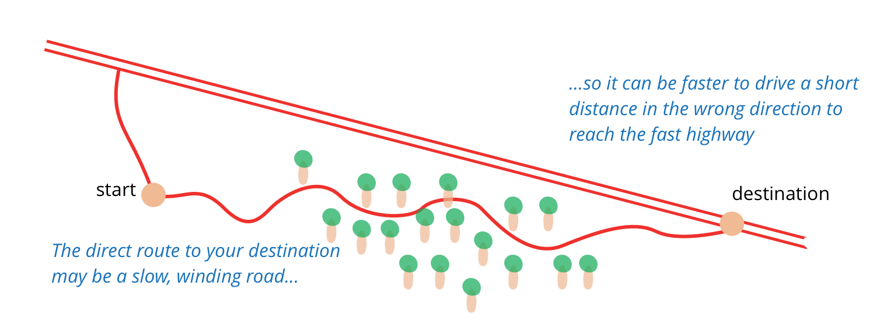
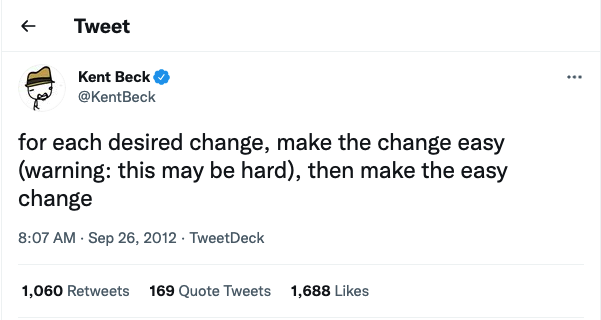

# 2.4 언제 리팩터링해야 할까?
나는 프로그래밍할 때 거의 한 시간 간격으로 리팩터링한다. 그러다 보니 내 작업 흐름에 리팩터링을 녹이는 방법이 여러 가지임을 알게 됐다.
#### 3의 법칙
이건 [돈 로버츠(Don Roberts)가 내게 제시한 가이드](https://en.wikipedia.org/wiki/Rule_of_three_(computer_programming))다.
1. 처음에는 그냥 한다.
2. 비슷한 일을 두 번째로 하게 되면(중복이 생겼다는 사실에 당황스럽겠지만), 일단 계속 진행한다.
3. 비슷한 일을 세번째 하게 되면 리팩터링한다.

야구를 좋아하는 사람은 '스크라이크 세번이면 리팩터링하라(삼진 리팩터링)'로 기억하자.

#### 준비를 위한 리팩터링: 기능을 쉽게 추가하게 만들기
리팩터링하기 가장 좋은 시점은 코드베이스에 기능을 새로 추가하기 직전이다. 이 시점에 현재 코드를 살펴보면서, 구조를 살짝 바꾸면 다른 작업을 하기가 훨씬 쉬워질 만한 부분을 찾는다. 가령 내 요구사항을 거의 만족하지만 리터럴 값 몇 개가 방해되는 함수가 있을 수 있다. 함수를 복제해서 해당 값만 수정해도 되지만, 그러면 중복 코드가 생긴다. 나중에 이 부분을 변경할 일이 생기면 원래 코드와 복제한 코드를 모두 수정해야 하며, 더 심한 경우는 복제한 코드가 어디있는지까지 일일이 찾아내야 한다. 이렇게 복사해서 붙여넣는 방식으로 처리하면 나중에 새 기능을 약간 변형한 버전을 만들어야 할 때 번거로울 수 있다. 그러서 이럴 때는 리팩터링 모자를 쓰고 [11.2 함수 매개변수화하기(Parameterize Function)](https://github.com/wonder13662/refactoring-v2/blob/writing/chapter11/11-2.md)를 적용한다. 그러고 나면 그 함수에 필요한 매개변수를 지정해서 호출하기만 하면 된다.

> 비유하면 지금 위치에서 동쪽으로 100km를 이동하려는데 그 사이를 숲이 가로막고 있다면, 좀 둘러가더라도 20km 북쪽에 있는 고속도로를 타는 편이 세 배나 빠를 수 있다. 다들 "직진!"을 외치더라도, 때로는 "잠깐, 지도를 보고 가장 빠른 경로를 찾아보자"고 말할 줄 알아야 한다. 준비를 위한 리팩터링이 바로 이런 역할을 한다. - [제시카 커(Jessica Kerr) - preparatory refactoring](https://martinfowler.com/articles/preparatory-refactoring-example.html)

버그를 잡을 때도 마찬가지다. 오류를 일으키는 코드가 세 곳에 복제되어 퍼져 있다면, 우선 한 곳으로 합치는 편이 작업하기에 훨씬 편하다. 또는 질의 코드에 섞여 있는 갱신 로직을 분리하면 두 작업이 꼬여서 생기는 오류를 크게 줄일 수 있다. 이처럼 [준비를 위한 리팩터링(preparatory refactoring)](https://martinfowler.com/articles/preparatory-refactoring-example.html)으로 상황을 개선해놓으면 버그가 수정된 상태가 오래 지속될 가능성을 높이는 동시에, 같은 곳에서 다른 버그가 발생할 가능성을 줄일 수도 있다.
#### 이해를 위한 리팩터링: 코드를 이해하기 쉽게 만들기
코드를 수정하려면 먼저 그 코드가 하는 일을 파악해야 한다. 그 코드를 작성한 사람은 자신일 수도 있고 다른 사람일 수도 있다. 나는 코드를 파악할 때마다 그 코드의 의도가 더 명확하게 드러나도록 리팩터링할 여지는 없는지 찾아본다. 조건부 로직의 구조가 이상하지 않은지 살펴보기도 하고, 함수 이름을 잘못 정해서 실제로 하는 일을 파악하는 데 시간이 오래 걸리지는 않는지도 살펴본다.

이쯤 되면 코드를 어느 정도 이해하게 되지만, 아쉽게도 나는 기억력이 나빠서 그런 세부사항을 오래 기억하지 못한다. 워드 커닝햄(Ward Cunningham)이 말하길, 리팩터링하면 머리로 이해한 것을 코드에 옮겨 담을 수 있다. 그런 다음 수정한 코드를 테스트해보면 내 생각이 맞았는지 확인 할 수 있다. 내가 이해한 것을 코드에 반영해두면 더 오래 보존할 수 있을 뿐만 아니라 동료들도 알 수 있다.

이렇게 하면 나중은 물론 지금 당장 효과를 볼 때도 많다. 나는 오래 전부터 자잘한 세부 코드에 이해를 위한 리팩터링(Comprehension Refactoring)을 해왔다. 어떤 역할을 하는지 이해된 변수는 적절한 이름으로 바꿔주고, 긴 함수를 잘게 나누기도 한다. 그러면 코드가 깔끔하게 정리되어 전에는 보이지 않던 설계가 눈에 들어오기 시작한다. 이 모든 변경을 머릿속으로 시뮬레이션해볼 만큼 내 머리가 좋지 않기 때문에 코드를 정리하지 않았다면 영원히 보지 못하고 지나쳤을지 모를 것들이다. 랄프 존슨(Ralph Johnson)은 이런 초기 단계의 리팩터링을 밖을 잘 내다보기 위한 창문 닦기에 비유한다. 코드를 분석할 때 리팩터링을 해보면, 그렇지 않았더라면 도달하지 못했을 더 깊은 수준까지 이해하게 된다. 이해를 위한 리팩터링을 의미없이 코드를 만지작거리는 것이라고 무시하는 이들은 복잡한 코드 아래 숨어 있는 다양한 기회를 결코 발견할 수 없다.

#### 쓰레기 줍기 리팩터링
코드를 파악하던 중에 일을 비효율적으로 처리하는 모습을 발견할 때가 있다. 로직이 쓸데없이 복잡하거나, 매개변수화한 함수 하나면 될 일을 거의 똑같은 함수 여러 개로 작성해놨을 수 있다. 이때 약간 절충을 해야 한다. 원래 하려던 작업과 관련 없는 일에 너무 많은 시간을 빼앗기긴 싫을 것이다. 그렇다고 쓰레기가 나뒹굴게 방치해서 나중에 일을 방해하도록 내버려두는 것도 좋지 않다. 나라면 간단히 수정할 수 있는 것은 즉시 고치고, 시간이 좀 걸리는 일은 짧은 메모만 남긴 다음, 하던 일을 끝내고 나서 처리한다. 이것이 이해를 위한 리팩터링의 변형인 쓰레기 줍기 리팩터링(Litter-Pickup Refactoring)이다.

물론 수정하려면 몇 시간이나 걸리고 당장은 더 급한 일이 있을 수 있다. 그렇더라도 조금이나마 개선해두는 것이 좋다. 캠핑 규칙이 제안하듯, 항상 처음 봤을 때보다 깔끔하게 정리하고 떠나자. 코드를 훑어볼 때마다 조금씩 개선하다 보면 결국 문제가 해결될 것이다. 리팩터링의 멋진 점은 각각의 작은 단계가 코드를 깨뜨리지 않는다는 사실이다. 그래서 작업을 잘게 나누면 몇 달에 걸쳐 진행하더라도 그 사이 한 순간도 코드가 깨지지 않기도 한다.

#### 계획된 리팩터링과 수시로 하는 리팩터링
앞에서 본 준비를 위한 리팩터링, 이해를 위한 리팩터링, 쓰레기 줍기 리팩터링은 모두 기회가 될 때만 진행한다. 나는 개발에 들어가기 전에 리팩터링 일정을 따로 잡아두지 않고, 기능을 추가하거나 버그를 잡는 동안 리팩터링도 함께 한다. 프로그래밍 과정에 자연스럽게 녹인 것이다. 기능을 추가할 때든 버그를 잡을 때든, 리팩터링은 눈 앞의 문제뿐 아니라 앞으로 할 작업에도 도움을 준다. 간과하기 쉽지만 굉장히 중요한 점이다. 리팩터링은 프로그래밍과 구분되는 별개의 활동이 아니다. 마치 프로그래밍할 때 `if`문 작성 시간을 따로 구분하지 않는 것과 같다. 그래서 나는 리팩터링 시간을 일정에 따로 잡아두지 않고, 대부분의 리팩터링을 다른 일을 하는 중에 처리한다.

> 보기 싫은 코드를 발견하면 리팩터링하자. 그런데 잘 작성된 코드 역시 수많은 리팩터링을 거쳐야 한다.

리팩터링은 과거에 저지른 실수를 바로잡거나 보기 싫은 코드를 정리하는 작업이라고 오해하기 쉽다. 보기 싫은 코드를 보면 리팩터링해야 함은 당연하지만, 잘 작성된 코드 역시 수많은 리팩터링을 거쳐야 한다. 나는 코드를 작성할 때마다 적절히 타협한다. 예컨대 매개변수화하거나 개별 함수로 나누는 기준을 정한다. 어제는 적합했던 기준이 오늘 하는 다른 작업에는 맞니 않을 수 있다. 이렇게 상황이 변해 기준을 변경해야 할 때 코드가 이미 깔끔하다면 리팩터링하기가 더 쉽다.

> 무언가 수정하려 할 때는 먼저 수정하기 쉽게 정돈하고(단, 만만치 않을 수 있다) 그런 다음 쉽게 수정하자 - 켄트 벡 [트위터 원문 링크](https://twitter.com/KentBeck/status/250733358307500032?s=20)

오랫동안 사람들은 소프트웨어 개발이란 뭔가 '추가'하는 과정으로 여겼다. 기능을 추가하다 보면 대개 새로운 코드를 작성해 넣게 된다. 하지만 뛰어난 개발자는 새 기능을 추가하기 쉽도록 코드를 '수정'하는 것이 그 기능을 가장 빠르게 추가하는 길일 수 있음을 안다. 소프트웨어 개발을 끝이 있는 작업으로 보면 안된다. 새 기능이 필요할 때마다 소프트웨어는 이를 반영하기 위해 수정된다. 이때 새로 작성해 넣는 코드보다 기존 코드의 수정량이 큰 경우가 대체로 많다.

그렇다고 해서 계획된 리팩터링이 무조건 나쁘다는 말은 아니다. 그동안 리팩터링에 소홀했다면, 따로 시간을 내서 새 기능을 추가하기 쉽도록 코드베이스를 개선할 필요가 있다. 이때 리팩터링에 투자한 일주일의 효과를 다음 몇 달 동안 누릴 수도 있다. 한편, 정기적으로 리팩터링하더라도 어떤 문제는 팀원 여럿이 달려들어야 할 정도로 곪아갈 수도 있다. 하지만 이런 이유로 계획된 리팩터링을 하게 되는 일은 최소한으로 줄여야 한다. 리팩터링 작업 대부분은 드러나지 않게, 기회가 될 때마다 해주어야 한다.

버전 관리 시스템에서 리팩터링 커밋과 기능 추가 커밋을 분리해야 한다는 조언을 들은 것이 있다. 이렇게 할 때의 큰 장점은 두 가지 활동을 구분해서 별개로 검토하고 승인할 수 있다는 것이다. 하지만 나는 이 견해에 완전히 동의하지는 않는다. 리팩터링은 기능 추가와 밀접하게 엮인 경우가 너무나 많기 때문에 굳이 나누는 것은 시간 낭비일 수 있다. 또한 해당 리팩터링을 하게 된 맥락 정보가 사라져서 왜 그렇게 수정했는지 이해하기가 어려워진다. 리팩터링 커밋을 분리한다고 해서 무조건 좋은 것은 아님을 명심하고, 여러분의 팀에 적합한 방식을 실험을 통해 찾아내야 한다.

#### 오래 걸리는 리팩터링
리팩터링은 대부분 몇 분 안에 끝난다. 길어야 몇 시간 정도다. 하지만 팀 전체가 달려들어도 몇 주는 걸리는 대규모 리팩터링도 있다. 라이브러리를 새 것으로 교체하는 작업일 수도 있고, 일부 코드를 다른 팀과 공유하기 위해 컴포넌트로 빼내는 작업일 수도 있다. 또는 그동안 작업하면서 쌓여온 골치 아픈 의존성을 정리하는 작업일 수도 있다.

나는 이런 상황에 처하더라도 팀 전체가 리팩터링에 매달리는 데는 회의적이다. 그보다는 주어진 문제를 몇 주에 걸쳐 조금씩 해결해가는 편이 효과적일 때가 많다. 누구든지 리팩터링 해야 할 코드와 관련한 작업을 하게 될 때마다 원하는 방향으로 조금씩 개선하는 식이다. 리팩터링이 코드를 깨뜨리지 않는다는 장점을 활용하는 것이다. 일부를 변경해도 모든 기능이 항상 올바르게 동작한다. 예컨대 라이브러리를 교체할 때는 기존 것과 새 것 모두를 포용하는 추상 인터페이스부터 마련한다. 기존 코드가 이 추상 인터페이스를 호출하도록 만들고 나면 라이브러리를 훨씬 쉽게 교체할 수 있다.(이 전략을 [추상화로 갈아타기 - Branch by Abstraction](https://martinfowler.com/bliki/BranchByAbstraction.html)라 한다).

#### 코드 리뷰에 리팩터링 활용하기
코드 리뷰를 정기적으로 수행하는 조직도 있다. 그렇지 않은 조직이라면 해보면 유익할 것이다. 코드 리뷰는 개발팀 전체에 지식을 전파하는데 좋다. 경험이 더 많은 개발자의 노하우를 더 적은 개발자에게 전수할 수 있다. 대규모 소프트웨어 시스템의 다양한 측면을 더 많은 사람이 이해하는 데도 도움이 된다. 깔끔한 코드를 작성하는 데에도 굉장히 중요하다. 내 눈에는 명확한 코드가 다른 팀원에게는 그렇지 않을 수 있다. 자신이 하는 일에 익숙하지 않은 사람의 관점에서 바라보기란 누구에게나 어렵기 때문이다. 코드 리뷰를 하면 다른 사람의 아이디어를 얻을 수 있다는 장점도 있다. 일주일이면 좋은 아이디어를 상당히 많이 수집할 수 있을 것이다. 이처럼 서로의 기여가 일을 더욱 편하게 만들어주므로 나는 기회가 닿는 대로 코드 리뷰를 한다.

리팩터링은 다른 이의 코드를 리뷰하는 데도 도움이 된다. 리팩터링을 활용하기 전에는 코드를 읽고, 그럭저럭 이해한 뒤, 몇가지 개선 사항을 제시했다. 지금은 새로운 아이디어가 떠오르면 리팩터링하여 쉽게 구현해 넣을 수 있는지부터 살펴본다. 쉽다면 실제로 리팩터링한다. 이 과정을 몇 번 반복하면 내가 떠올린 아이디어를 실제로 적용했을 때의 모습을 더 명확하게 볼 수 있다. 머리로만 상상하는 게 아니라 눈으로 직접 확인하는 것이다. 그러다 보면 리팩터링해보지 않고는 절대 떠올릴 수 없던 한 차원 높은 아이디어가 떠오르기도 한다.

리팩터링은 코드 리뷰의 결과를 더 구체적으로 도출하는 데에도 도움이 된다. 개선안들을 제시하는 데서 그치지 않고, 그 중 상당수를 즉시 구현해볼 수 있기 때문이다. 코드 리뷰를 이런 식으로 진행하면 훨씬 큰 성취감을 맛볼 수 있다.

코드 리뷰에 리팩터링을 접목하는 구체적인 방법은 리뷰의 성격에 따라 다르다. 흔히 쓰는 풀 요청 모델(pull request model - 코드 작성자 없이 검토하는 방식)에서는 그리 효과적이지 않다. 코드 작성자가 참석해야 맥락을 설명해줄 수 있고 작성자도 리뷰어의 변경 의도를 제대로 이해할 수 있으므로, 이왕이면 참석자가 참석하는 방식이 좋다. 내가 경험한 가장 좋은 방법은 작성자와 나란히 앉아서 코드를 훑어가면서 리팩터링하는 것이다. 이렇게 하면 자연스럽게 (프로그래밍 과정 안에 지속적인 코드 리뷰가 녹아 있는) **짝 프로그래밍(pair programming)**이 된다.

#### 관리자에게는 뭐라고 말해야 할까?
내가 가장 많이 받는 질문 중 하나는 "관리자에게 리팩터링에 대해 어떻게 말해야 하나요?"다. 관리자와 고객이 '리팩터링은 누적된 오류를 잡는 일이거나, 혹은 가치 있는 기능을 만들어내지 못하는 작업'이라고 오해하여 리팩터링이 금기어가 되어버린 조직도 있었다. 리팩터링만을 위한 일정을 몇 주씩 잡는 개발팀을 보면 오해는 더욱 커진다. 설상가상으로 실제로는 리팩터링이 아닌, 어설픈 재구성(restructuring) 작업을 하면서 코드베이스를 오히려 망가뜨리는 모습을 보면 불신이 증폭된다.

관리자가 기술에 정통하고 설계 지구력 가설도 잘 이해하고 있다면 리팩터링의 필요성을 쉽게 설득할 수 있다. 이런 관리자는 오히려 정기적인 리팩터링을 권장할 뿐만 아니라 팀이 리팩터링을 충분히 하고 있는지 살펴보기도 한다. 그러면 팀이 수행하는 리팩터링이 과도할 수는 있어도, 부족할 가능성은 거의 없다.

물론 기술을 모르는 상당수의 관리자와 고객은 코드베이스의 건강 상태가 생산성에 미치는 영향을 모른다. 이런 상화엥 있는 이들에게는 "리팩터링한다고 말하지 말라"고 조언하겠다.

하극상일까? 그렇진 않다. 소프트웨어 개발자는 프로다. 프로 개발자의 역할은 효과적인 소프트웨어를 최대한 빨리 만드는 것이다. 내 경험상 리팩터링하면 소프트웨어를 빠르게 만드는 데 아주 효과적이다. 새 함수를 추가하려는데 현재 설계가 적합하지 않다면 먼저 리팩터링하고 나서 함수를 추가하는 편이 빠르다. 버그를 수정하려면 현재 소프트웨어의 작동 방식을 이해해야 한다. 이때도 리팩터링부터 하는 편이 빠르다. 일정을 최우선으로 여기는 관리자는 최대한 빨리 끝내는 방향으로 진행하기를 원한다. 그리고 구체적인 방법은 개발자가 판단해야 한다. 프로 개발자에게 주어진 임무는 새로운 기능을 빠르게 구현하는 것이고, 가장 빠른 방법은 리팩터링이다. 그래서 리팩터링부터 한다.

#### 리팩터링하지 말아야 할 때
지금까지의 이야기가 무조건 리팩터링을 권장한다고 들릴 수 있는데, 리팩터링하면 안되는 상황도 있다. 

나는 지저분한 코드를 발견해도 굳이 수정할 필요가 없다면 리팩터링하지 않는다. 외부 API 다루듯 호출해서 쓰는 코드라면 지저분해도 그냥 둔다. 내부 동작을 이해해야 할 시점에 리팩터링해야 효과를 제대로 볼 수 있다.

리팩터링하는 것보다 처음부터 새로 작성하는 게 쉬울 때도 리팩터링하지 않는다. 사실 이런 결정을 내리기는 쉽지 않다. 직접 리팩터링해보기 전에는 어느 쪽이 쉬운지 확실히 알 수 없을 때도 많기 때문이다. 리팩터링할지 새로 작성할지를 잘 결정하려면 뛰어난 판단력과 경험이 뒷받침이 되어야 한다. 그래서 이 판단에 대해서는 한 마디 조언으로 표현하기는 어렵다.