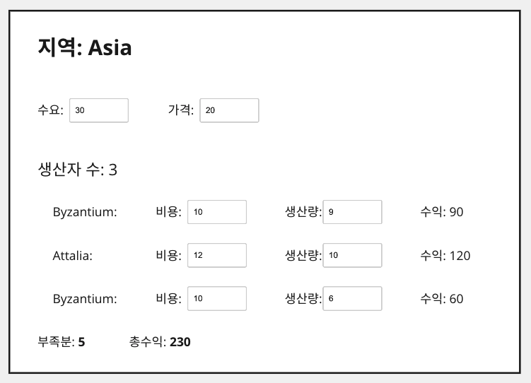

# 4.2 테스트할 샘플 코드(Sample Code to Test)
우선 테스트 대상이 될 코드를 살펴보자. 이 코드는 사용자가 생산 계획을 검토하고 수정하도록 해주는 간단한 애플리케이션의 일부다. UI는 (좀 투박하지만) 다음과 같다.



생산 계획은 각 지역(province)의 수요(demand)와 가격(price)으로 구성된다. 지역에 위치한 생산자(producer)들은 각기 제품을 특정 가격으로 특정 수량만큼 생산할 수 있다. UI는 생산자별로 제품을 모두 판매했을 때 얻을 수 있는 수익(full revenue)도 보여준다. 화면 맨 아래에는 (수요에서 총생산량을 뺀) 생산 부족분(shortfall)과 현재 계획에서 거둘 수 있는 총수익(profit)도 보여준다. 사용자는 UI에서 수요, 가격, 생산자별 생산량(production)과 비용(cost)을 조정해가며, 그에 따른 생산 부족분과 총수익을 확인할 수 있다. 사용자가 화면에서 숫자를 변경할 때마다 관련 값들이 즉각 갱신된다.

그림의 UI를 보면 이 소프트웨어의 전반적인 기능을 파악할 수 있는데, 여기서는 비즈니스 로직 부분만 집중해서 살펴본다. 다시 말해 수익과 생산 부족분을 계산하는 클래스들만 살펴보고, HTML을 생성하고 필드 값 변경에 반응하여 밑단의 비즈니스 로직을 적용하는 코드는 생략한다. 이 장의 목적은 어디까지나 자가 테스트 코드 작성법을 파악하는 데 있다. 따라서 UI, 영속성, 외부 서비스 연동과는 관련 없는 가장 쉬운 코드부터 보는 게 합당할 것이다. 참고로 코드는 항상 이렇게 성격에 따라 분리하는 것이 좋다. 만약 여기서 살펴볼 비즈니스 로직 코드도 아주 복잡해진다면, UI와 분리하여 코드를 파악하고 테스트하기 편하게 수정했을 것이다.

비즈니스 로직 코드는 클래스 두 개로 구성된다. 하나는 생산자를 표현하는 `Producer`이고, 다른 하나는 지역 전체를 표현하는 `Province`다. `Province`의 생성자는 JSON 문서로부터 만들어진 자바스크립트 객체를 인수로 받는다.

JSON 데이터로부터 지역 정보를 읽어오는 코드는 다음과 같다.

``` javascript
class Province {
  constructor(doc) {
    this._name = doc.name;
    this._producers = [];
    this._totalProduction = 0;
    this._demand = doc.demand;
    this._price = doc.price;
    doc.producers.forEach(d => this.addProducer(new Producer(this, d)));
  }

  addProducer(arg) {
    this._producers.push(arg);
    this._totalProduction += arg.production;
  }
}
```

다음의 `sampleProvinceData()` 함수는 앞 생성자의 인수로 쓸 `JSON` 데이터를 생성한다. 이 함수를 테스트하려면 이 함수가 반환한 값을 인수로 넘겨서 `Province`객체를 생성해보면 된다.

``` javascript
// 최상위
function sampleProvinceData() {
  return {
    name: "Asia", 
    producers: [
      {
        name: 'Byzantium',
        cost: 10,
        production: 9,
      },
      {
        name: 'Attalia',
        cost: 12,
        production: 10,
      },
      {
        name: 'Sinope',
        cost: 10,
        production: 6,
      }
    ],
    demand: 30,
    price: 20,
  }
};
```

`Province` 클래스에는 다양한 데이터에 대한 접근자들이 담겨 있다.
``` diff
class Province {
  constructor(doc) {
    this._name = doc.name;
    this._producers = [];
    this._totalProduction = 0;
    this._demand = doc.demand;
    this._price = doc.price;
    doc.producers.forEach(d => this.addProducer(new Producer(this, d)));
  }

  addProducer(arg) {
    this._producers.push(arg);
    this._totalProduction += arg.production;
  }

+ get name() { return this._name; }  
+ get producers() { return this._producers.slice(); }
+ get totalProduction() { return this._totalProduction; }
+ set totalProduction(arg) { this._totalProduction = arg; }
+ get demand() { return this._demand; }
+ set demand(arg) { this._demand = parseInt(arg); } // 숫자로 파싱해서 저장
+ get price() { return this._price; }
+ set price(arg) { this._price = parseInt(arg); } // 숫자로 파싱해서 저장
}
```

세터는 UI에서 입력한 숫자를 인수로 받는데, 이 값은 문자열로 전달된다. 그래서 계산에 활용하기 위해 숫자로 파싱한다.

`Producer` 클래스는 주로 단순한 데이터 저장소로 쓰인다.

```javascript
class Producer {
  constructor(aProvince, data) {
    this._province = aProvince;
    this._cost = data.cost;
    this._name = data.name;
    this._production = data.production || 0;
  }

  get name() { return this._name; }
  get cost() { return this._cost; }
  set cost(arg) { this._cost = parseInt(arg); }

  get production() { return this._production; }
  set production(amountStr) {
    const amount = parseInt(amountStr);
    const newProduction = Number.isNaN(amount) ? 0 : amount;
    this._province.totalProduction += newProduction - this._production;
    this._production = newProduction;
  }
}
```

`set production()`이 계산 결과를 지역 데이터(`_province`)에 갱신하는 코드가 좀 지저분하다. 나는 이런 코드를 목격하면 리팩터링해서 제거하고 싶어지지만, 그러려면 먼저 테스트를 작성해야 한다.

생산 부족분을 계산하는 코드는 간단하다.

``` diff
class Province {
  constructor(doc) {
    this._name = doc.name;
    this._producers = [];
    this._totalProduction = 0;
    this._demand = doc.demand;
    this._price = doc.price;
    doc.producers.forEach(d => this.addProducer(new Producer(this, d)));
  }

  addProducer(arg) {
    this._producers.push(arg);
    this._totalProduction += arg.production;
  }

  get name() { return this._name; }  
  get producers() { return this._producers.slice(); }
  get totalProduction() { return this._totalProduction; }
  set totalProduction(arg) { this._totalProduction = arg; }
  get demand() { return this._demand; }
  set demand(arg) { this._demand = parseInt(arg); } // 숫자로 파싱해서 저장
  get price() { return this._price; }
  set price(arg) { this._price = parseInt(arg); } // 숫자로 파싱해서 저장
+ get shortfall() {
+   return this._demand - this.totalProduction;
+ }  
}
```

수익을 계산하는 코드는 살짝 복잡하다.

``` diff
class Province {
  constructor(doc) {
    this._name = doc.name;
    this._producers = [];
    this._totalProduction = 0;
    this._demand = doc.demand;
    this._price = doc.price;
    doc.producers.forEach(d => this.addProducer(new Producer(this, d)));
  }

  addProducer(arg) {
    this._producers.push(arg);
    this._totalProduction += arg.production;
  }

  get name() { return this._name; }  
  get producers() { return this._producers.slice(); }
  get totalProduction() { return this._totalProduction; }
  set totalProduction(arg) { this._totalProduction = arg; }
  get demand() { return this._demand; }
  set demand(arg) { this._demand = parseInt(arg); } // 숫자로 파싱해서 저장
  get price() { return this._price; }
  set price(arg) { this._price = parseInt(arg); } // 숫자로 파싱해서 저장
  get shortfall() {
    return this._demand - this.totalProduction;
  }
+ get profit() {
+   return this.demandValue - this.demandCost;
+ }
+ get demandValue() {
+   return this.satisfiedDemand * this.price;
+ }
+ get satisfiedDemand() {
+   return Math.min(this._demand, this.totalProduction);
+ }
+ get demandCost() {
+   let remainingDemand = this.demand;
+   let result = 0;
+   this.producers
+     .sort((a,b) => a.cost - b.cost)
+     .forEach(p => {
+       const contribution = Math.min(remainingDemand, p.production);
+       remainingDemand -= contribution;
+       result += contribution * p.cost;
+     });
+   return result;
+ }
}
```

- [목차](https://github.com/wonder13662/refactoring-v2/blob/writing)
- [4 테스트 구축하기](https://github.com/wonder13662/refactoring-v2/blob/writing/chapter04)
- [4.1 자가 테스트 코드의 가치(The Value of Self-Testing Code)](https://github.com/wonder13662/refactoring-v2/blob/writing/chapter04/4-1.md)
- [4.3 첫 번째 테스트(A First Test)](https://github.com/wonder13662/refactoring-v2/blob/writing/chapter04/4-3.md)