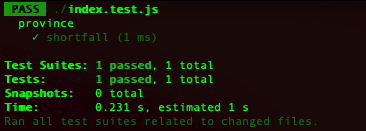
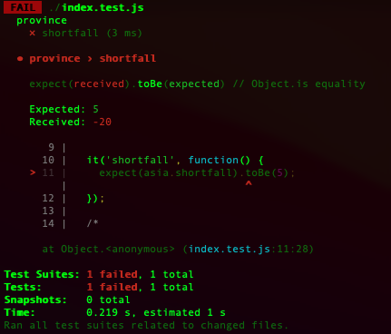

# 4.3 첫 번째 테스트(A First Test)
이 코드를 테스트하기 위해서는 먼저 테스트 프레임워크를 마련해야 한다. 시중에는 다양한 프레임워크가 있는데, 자바스크립트용으로 나온 것만 해도 여러 개다. 여기서는 현재 널리 쓰이고 나름 좋다고 알려진 모카(Mocha)를 사용한다.

> 위 내용의 테스트 코드들은 src 디렉터리 안에 작성해두었습니다. 테스트프레임워크는 모카(Mocha)가 아닌 Jest를 사용했습니다.

종합적인 사용법을 설명하기 보다는 테스트 예시 몇 가지를 실행하는 모습을 바로 보여주겠다. 다른 프레임워크를 사용하더라도 비슷한 테스트를 어렵지 않게 구축할 수 있을 것이다.

다음은 생산 부족분을 제대로 계산하는지 확인하는 테스트다.
```javascript
describe('province', function() {
  it('shortfall', function() {
    const asia = new Province(sampleProvinceData()); // 1. 픽스처 설정
    assert.equal(asia.shortfall, 5); // 2. 검증
  });
});
```

모카 프레임워크는 테스트 코드를 블록 단위로 나눠서 각 블록에 테스트 스위트를 담는 구조다. 테스트는 `it`블록에 담긴다. 앞의 예에서는 테스트를 두 단계로 진행했다. (1)첫 번째 단계에서는 테스트에 필요한 데이터와 객체를 뜻하는 픽스처(fixture)를 설정한다. 이 예시에서는 샘플 지역 정보로부터 생성한 `Province` 객체를 픽스처로 설정했다. (2)두 번째 단계에서는 이 픽스처의 속성들을 검증하는데, 여기서는 주어진 초깃값에 기초하여 생산 부족분을 정확히 계산했는지 확인한다.

> `describe` 블록과 `it` 블록에 부연 설명용 문자열을 써 넣는 방식은 개발자마다 다르다. 테스트가 무엇을 검사하는지를 설명해 넣는 사람이 있는 반면, 마치 명확한 코드에는 주석이 필요 없는 것과 같은 맥락에서 이 공간을 그냥 비워두는 사람도 있다. 나는 실패한 테스트가 무엇인지 식별할 수 있을 정도로만 작성하는 편이다.

이 테스트를 Node.js 콘솔에서 실행하면 다음과 같이 출력된다.



피드백이 굉장히 간결하다. 보다시피 수행한 테스트와 통과한 테스트의 수만 간략히 보여준다.

> 실패해야 할 상황에는 반드시 실패하게 만들자.

지금처럼 기존 코드를 검증하는 테스트를 작서했고 모두 통과했다는 건 좋은 일이다. 하지만 나는 기본적으로 회의적인 인간이다. 특히 수많은 테스트를 실행했음에도 실패하는 게 없다면 테스트가 내 의도와는 다른 방식으로 코드를 다루는 건 아닌지 불안해진다. 그래서 각각의 테스트가 실패하는 모습을 최소한 한 번씩은 직접 확인해본다. 이를 위해 내가 흔히 쓰는 방법은 일시적으로 코드에 오류를 주입하는 것이다. 예를 들면 다음과 같다.
```javascript
class Province {
  // 생략
  get shortfall() {
    return this._demand - this.totalProduction * 2; // 오류 주입
  }
  // 생략
}
```



이처럼 테스트 프레임워크를 이용하면 무언가 문제가 생겼을 때 즉시 알 수 있다. 게다가 어느 테스트가 실패했는지 짚어주고, 실패 원인을 추론해 볼 수 있는 단서까지 제공한다. 이 예에서는 기대한 값과 실제로 나온 값을 단서로 제시했고, 그 원인은 물론 방금 내가 주입한 오류였다.

> 자주 테스트하라. 작성 중인 코드는 최소한 몇 분 간격으로 테스트하고, 적어도 하루에 한 번은 전체 테스트를 돌려보자.

실전에서는 테스트의 수는 수천 개 이상일 수 있다. 뛰어난 테스트 프레임워크를 사용한다면 이렇게 많은 테스트도 간편하게 실행할 수 있고 무언가 실패한다면 금방 확인할 수 있다. 간결한 피드백은 자가 테스트에서 매우 중요하다. 나는 일할 때 테스트를 굉장히 자주 한다. 방금 추가한 코드에 문제가 없는지, 혹은 리팩터링하면서 실수한 것은 없는지 확인하기 위해서다.

모카 프레임워크는 소위 어셔션(assertion) 라이브러리라고 하는 픽스처 검증 라이브러리를 선택해 사용할 수 있다 - `jest`는 `expect`를 사용. 현재 자바스크립트용 어서션 라이브러리는 엄청나게 많고, 그 중 일부는 여러분이 이 책을 읽는 순간까지도 여전히 현역일 것이다. 이 책에서는 [차이(chai)](https://www.chaijs.com/) 라이브러리를 사용하겠다. 차이를 사용하면 다음과 같이 `assert`문을 이용해 코드를 검증할 수 있다.

```diff
describe('province', function(){
  it('shortfall', function(){
    const asia = new Province(sampleProvinceData());
+   assert.equal(asia.shortfall, 5);
  });
});
```

또는 다음과 같이 `expect`문을 이용할 수 있다.

```diff
describe('province', function(){
  it('shortfall', function(){
    const asia = new Province(sampleProvinceData());
-   assert.equal(asia.shortfall, 5);
+   expect(asia.shortfall).toBe(5);
  });
});
```

개인적으로 `assert`를 선호하지만 자바스크립트를 다룰 때는 `expect`를 주로 사용할 것이다.

테스트를 실행하는 방식은 테스트마다 다르다. 난 자바로 프로그래밍할 때는 GUI 테스트 러너를 제공하는 IDE를 사용한다. GUI 환경에서는 테스트가 실행되면 프로그레스바가 초록색으로 표시되다가 테스트 중 하나라도 실패하면 빨간색으로 바뀐다. 그래서 내 동료들은 테스트의 진행 상태를 흔히 '초록 막대(green bar)'와 '빨간 막대(red bar)'라고 부른다. 그래서 "실패한 테스트가 하나라도 있으면 리팩터링하면 안 된다"라는 의미로 흔히들 "빨간 막대일 때는 리팩터링 하지 말라"라고 말한다. 한편 "최근 변경을 취소하고 마지막으로 모든 테스트를 통과했던 상태로 돌아가라"라고 전하고 싶을 때는 "초록 막대로 되돌려라"라고 말한다(보통은 버전 관리 시스템의 최근 체크포인트로 돌아가면 된다).

GUI 테스트 러너가 편하지만 반드시 필요한 것은 아니다. 나는 이맥스에서 키 하나만 누르면 테스트 전체를 실행하도록 만들어 두고, 컴파일 창에 텍스트로 출력된 결과를 확인하는 방식도 많이 쓴다. 핵심은 (GUI냐 콘솔이냐가 아니라) 모든 테스트가 통과했다는 사실을 빨리 알 수 있다는 데 있다.