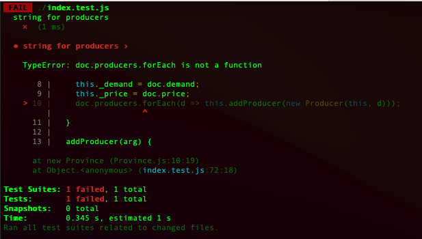

# 4.6 경계 조건 검사하기(Probing the Boundaries)
지금까지 작성한 테스트는 모든 일이 순조롭고 사용자도 우리 의도대로 사용하는, 일명 '꽃길(happy path)' 상황에 집중하였다. 그런데 이 범위를 벗어나는 경계 지점에서 문제가 생기면 어떤 일이 벌어지는지 확인하는 테스트도 함께 작성하면 좋다.

나는 이번 예시의 `producers`와 같은 컬렉션과 마주하면 그 컬렉션이 비었을 때 어떤 일이 일어나는지 확인하는 편이다.

```diff
+describe('no producer', function() { // 생산자가 없다.
+ let noProducers;
+ beforeEach(function() {
+   const data = {
+     name: 'No producers',
+     producers: [],
+     demand: 30,
+     price: 20,
+   };
+   noProducers = new Province(data);
+ });

+ it('shortfall', function() {
+   expect(noProducers.shortfall).toBe(30);
+ });

+ it('profit', function() {
+   expect(noProducers.profit).toBe(0);
+ });
});
```

숫자형이라면 0일 때를 검사해본다.

```diff
describe('province', function(){
  let asia;
  beforeEach(function(){
    asia = new Province(sampleProvinceData());
  });
  it('shortfall', function(){
    const asia = new Province(sampleProvinceData());
    expect(asia.shortfall).equal(5);
  });

  it('profit', function() {
    const asia = new Province(sampleProvinceData());
    expect(asia.profit).equal(230);
  });

  it('change production', function() {
    asia.producers[0].production = 20;
    expect(asia.shortfall).equal(-6);
    expect(asia.profit).equal(292);
  });

+ it('zero demand', function() { // 수요가 없다.
+   asia.demand = 0;
+   expect(asia.shortfall).toBe(-25);
+   expect(asia.profit).toBe(0);
+ });
});
```

음수도 넣어보면 좋다.

```diff
describe('province', function(){
  let asia;
  beforeEach(function(){
    asia = new Province(sampleProvinceData());
  });
  it('shortfall', function(){
    const asia = new Province(sampleProvinceData());
    expect(asia.shortfall).equal(5);
  });

  it('profit', function() {
    const asia = new Province(sampleProvinceData());
    expect(asia.profit).equal(230);
  });

  it('change production', function() {
    asia.producers[0].production = 20;
    expect(asia.shortfall).equal(-6);
    expect(asia.profit).equal(292);
  });

  it('zero demand', function() { // 수요가 없다.
    asia.demand = 0;
    expect(asia.shortfall).toBe(-25);
    expect(asia.profit).toBe(0);
  });

+ it('negative demand', function() { // 수요가 마이너스다.
+   asia.demand = -1;
+   expect(asia.shortfall).toBe(-26);
+   expect(asia.profit).toBe(-10);
+ });
});
```

여기서 한 가지 의문이 들 수 있다. 수요가 음수일 때 수익이 음수가 나온다는 것이 이 프로그램을 사용하는 고객 관점에서 말이 되는 소리일까? 수요의 최솟값은 0이어야 하지 않나? 그래서 수요 세터에 전달된 인수가 음수라면 에러를 던지거나 무조건 0으로 설정하는 식으로 정상적인 경우와 다르게 처리해야 하지 않을까? 예리한 지적이다. 이처럼 경계를 확인하는 테스트를 작성해보면 프로그램에서 이런 특이 상황을 어떻게 처리하는 게 좋을지 생각해볼 수 있다.

> 문제가 생길 가능성이 있는 경계 조건을 생각해보고 그 부분을 집중적으로 테스트하자.

이 프로그램의 세터들은 의미상 숫자만 입력받아야 하지만 UI로부터 문자열을 취하고 있다. 그러다 보니 필드가 아예 비어 있을 수 있고, 이때도 내가 의도한 대로 잘 처리하는지 반드시 테스트해야 한다.

```diff
describe('province', function(){
  let asia;
  beforeEach(function(){
    asia = new Province(sampleProvinceData());
  });
  it('shortfall', function(){
    const asia = new Province(sampleProvinceData());
    expect(asia.shortfall).toBe(5);
  });

  it('profit', function() {
    const asia = new Province(sampleProvinceData());
    expect(asia.profit).toBe(230);
  });

  it('change production', function() {
    asia.producers[0].production = 20;
    expect(asia.shortfall).toBe(-6);
    expect(asia.profit).toBe(292);
  });

  it('zero demand', function() { // 수요가 없다.
    asia.demand = 0;
    expect(asia.shortfall).toBe(-25);
    expect(asia.profit).toBe(0);
  });

  it('negative demand', function() { // 수요가 마이너스다.
    asia.demand = -1;
    expect(asia.shortfall).toBe(-26);
    expect(asia.profit).toBe(-10);
  });

+ it('empty string demand', function() { // 수요 입력란이 비어 있다.
+   asia.demand = '';
+   expect(asia.shortfall).toBe(NaN);
+   expect(asia.profit).toBe(NaN);
+ });
});
```

자, 내가 스스로 작성한 코드를 적으로 돌리고 있음이 느껴지는가? 나는 의식적으로 프로그램을 망가뜨리는 방법을 모색하는데, 이런 마음 자세가 생산성과 재미를 끌어올려준다. 내 마음 속에 잠재하는 사악한 욕구를 충족시켜주기 때문인 것 같다.

이어서 흥미로운 테스트를 준비했다.

```diff
+describe('string for producers', function() { // 생산자 수 필드에 문자열을 대입한다.
+ it('', function() {
+   const data = {
+     name: 'No producers',
+     producers: '',
+     demand: 30,
+     price: 20,
+   };
+   const prov = new Province(data);
+   expect(prov.shortfall).toBe(0);
+ });
+});
```

이 테스트는 단순히 생산 부족분이 0이 아니라는 실패 메시지를 출력하는 대신, 다음과 같이 출력한다.



테스트 프레임워크(jest)는 이 경우를 실패로 처리한다. 하지만 에러와 실패를 구분하는 다른 테스트 프레임워크도 많다. 실패(failure)란 검증 단계에서 실제 값이 예상 범위를 벗어났다는 뜻이다. 에러(error)는 성격이 다르다. 검증보다 앞선 과정(이 예에서는 설정 단계)에서 발생한 예외 상황을 말한다. 코드 작성자가 이 상황을 미처 예상하지 못한 것이고, 그래서 자바스크립트 프로그래머라면 지긋지긋하게 보는 오류 메시지인 `"... is not a function"`이 출력된 것이다.

프로그램은 이 상황에 어떻게 대응해야 할까? 에러 상황을 지금보다 잘 처리하도록 코드를 추가하는 방법도 있다. 더 의미있는 오류 메시지를 출력할 수도 있고, 그냥 (로그 메시지만 남기고) `producers`를 빈 배열로 설정할 수도 있다. 물론 지금 상태로 남겨둘 합당한 이유가 있을수도 있다. 예컨대 입력 객체를 (같은 코드베이스 안처럼) 신뢰할 수 있는 곳에서 만들어주는 경우가 여기 속한다. 같은 코드베이스의 모듈 사이에 유효성 검사(validation check) 코드가 너무 많으면 다른 곳에서 확인한 걸 중복으로 검증하여 오히려 문제가 될 수 있다. 반면, `JSON`으로 인코딩된 요청처럼 외부에서 들어온 입력 객체는 유효한지 확인해봐야 하므로 테스트를 작성한다. 어떤 경우든 경계 조건을 검사하는 테스트를 작성하다 보면 이런 고민들을 하게 된다.

나는 리팩터링하기 전이라면 이런 테스트를 작성하지 않을 것이다. 리팩터링은 겉보기 동작에 영향을 주지 않아야 하며, 이런 오류는 겉보기 동작에 해당하지 않는다. 따라서 경계 조건에 대응하는 동작이 리팩터링 때문에 변하는지 신경 쓸 필요 없다.

> 이런 오류로 인해 프로그램 내부에 잘못된 데이터가 흘러서 디버깅하기 어려운 문제가 발생한다면 [10.6 어서션 추가하기(Introduce Assertion)](https://github.com/wonder13662/refactoring-v2/blob/writing/chapter10/10-6.md)를 적용해서 오류가 최대한 빨리 드러나게 하자. 어서션도 일종의 테스트로 볼 수 있으니 테스트 코드를 따로 작성할 필요는 없다.

> 어차피 모든 버그를 잡아낼 수는 없다고 생각하여 테스트를 작성하지 않는다면 대다수의 버그를 잡을 수 있는 기회를 날리는 셈이다.

그렇다면 테스트를 어느 수준까지 해야 할까? 아무리 테스트해도 버그 없는 완벽한 프로그램을 만들 수는 없다는 말은 많이 들어봤을 것이다. 맞는 말이지만, 테스트가 프로그래밍 속도를 높여준다는 사실에는 변함이 없다. 그동안 나는 프로그램에서 발생할 수 있는 모든 경우를 테스트하기 위한 다양한 기법을 보아왔다. 이런 기법이 도움이 되는 것은 분명하지만, 너무 빠져들 필요는 없다. 테스트에도 수확 체감 법칙(law of diminishing returns)이 적용된다. 또, 테스트를 너무 많이 작성하다 보면 오히려 의욕이 떨어져 나중에는 하나도 작성하지 않게 될 위험도 있다. 따라서 위험한 부분에 집중하는 게 좋다. 코드에서 처리 과정이 복잡한 부분을 찾아보자. 함수에서 오류가 생길만한 부분을 찾아보자. 테스트가 모든 버그를 걸러주지는 못할지라도, 안심하고 리팩터링 할 수 있는 보호막은 되어준다. 그리고 리팩터링을 하면서 프로그램을 더욱 깊이 이해하게 되어 더 많은 버그를 찾게 된다. 나는 항상 테스트 스위트부터 갖춘 뒤에 리팩터링하지만, 리팩터링하는 동안에도 계속 테스트를 추가한다.

- [4.5 픽스처 수정하기(Modifying the Fixture)](https://github.com/wonder13662/refactoring-v2/blob/writing/chapter04/4-5.md)
- [4.7 끝나지 않은 여정(Much More Than this)](https://github.com/wonder13662/refactoring-v2/blob/writing/chapter04/4-7.md)